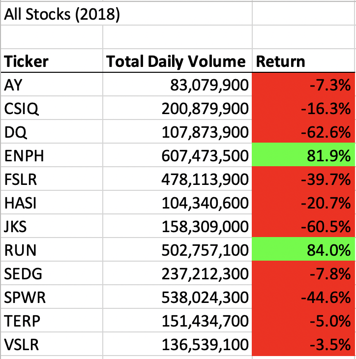
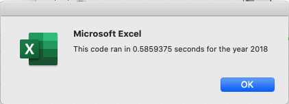

# VBA Challenge

## Overview of Project
Steve's parents thought it fate to go all in with Daqo New Energy when they noticed the stock's ticker, DQ, since they met at Dairy Queen. Steve is a recent finance graduate and wants to help his parents create a diversified portfolio with large trade volume and high return stocks. Since Steve's VBA skills still need some fine tuning, he contacted me to create a dynamic financial model that can capture stocks trade volumes and returns from changing data sets. The model must be able to draw insights from varying years and tickers.  

### Purpose
The purpose of this challenge is to build a dynamic financial model that Steve could use to identify stocks with large trade volumes and high returns in order to build and manage his parent's portfolio on a yearly basis. 

## Results
After building the financial model, Steve ran the model with 12 stocks that he's thinking of using in the portfolio. Here are the results: 

### 2017 Portfolio Performance
Overall, 2017 was a good year for this portfolio of stocks with the exeption of TERP which showed -7.2% return for the year. It's also important to point out that even though DQ had the highest return out of all the stocks in the portfolio, its total daily volume was the lowest. In fact, the total daily volume for SPWR was 22 times larger than DQ. Steve must evaluate if DQ fits his definition of high trade volume stocks and should remain in the portfolio. 

### 2018 Portfolio Performance 
2018 was a tough year for the bunch. All except two stocks ended the year with negative returns. ENPH and RUN both grew total daily volume and maintained positive returns in what was a clear bear market for the portfolio. Steve should keep these two stocks in the portfolio and discard all other stocks, including DQ. However, Steve still needs to bring in more stocks to the portfolio to diversify. Thus, Steve should continue to pull in stocks to the financial model until he reaches 12 stocks that fit the portfolio's criteria. 

### Financial Model Performance 
Two subroutines were created in a search for the fastest run-time. It was critical to optimize the model's performance since size of data set is undifined. 

### Original Subroutine Performance 
This subroutine used nested loops to go through the data set. In fact, this subroutine went through the entire data set 12 times: 1 time per ticker. This structure was not scalable for unknown tiker quantities in a data set. 

### Refactored Subroutine Performance 
This subroutine did not use nested loops to go through the data set. It just went through the data set once! As a result, this refactored subroutine performed the calculations 0.4 seconds faster than the original subroutine, and this difference would only increase as ticker quantities increase. Thus, this is a scalable structure that supports unknown tiker quantities in a data set. 

 

### Summary
As seen in this exercise, refactoring code may be advantagious to improve program speed. It's critical to look for ways to make the code run faster when dealing with varying data sets. However, regactoring code is time consuming and may not be necesary when dealing with fixed data sets. 
